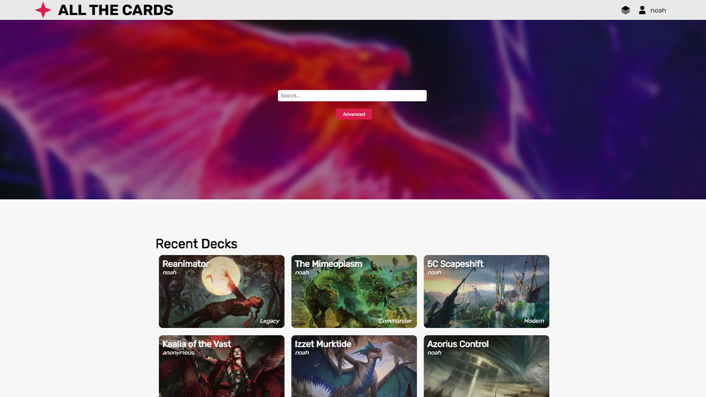

# All The Cards - Frontend

## Introduction

We present to you, yet another Magic: The Gathering online library. All The Cards allows users to explore, create, and share decks, custom cards, and favorites. This repo is specific to the frontend for handling user interactions and sending data to the server.

## Technologies

This project is coded in JavaScript, using [React.js](https://reactjs.org/). The catalog of data is courtesy of [Scryfall API](https://scryfall.com/docs/api).

## Installation

To run this project, you will need to have [NodeJS](https://nodejs.org/en/) installed on your system. Unzip the folder, open PowerShell or Bash in that folder, and run `npm install`. Then you can run `npm start` to run the client.

## Development Setup

The URL is [http://localhost:3000](http://localhost:3000) for the client.

## License

All The Cards is unofficial Fan Content permitted under the [Fan Content Policy](https://company.wizards.com/en/legal/fancontentpolicy). This project is not sponsered/endorsed by Wizards. Portions of the materials used are property of Wizards of the Coast. ©Wizards of the Coast LLC.

## Contributors

`Frontend` Tanner Hawkins\
`Frontend` Michael Lanctot\
`Backend` Jamier Singleton\
`Frontend` Noah Stephenson

## Project Status

`Pre-Alpha` Stage Development.
